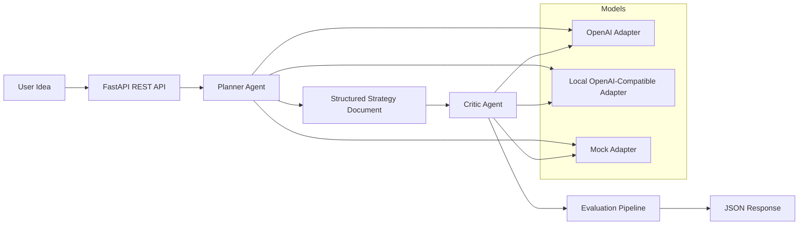

# Product Strategy Copilot

Product Strategy Copilot is a FastAPI application that turns plain-English product ideas into structured strategy briefs, critiques them with a second agent, and reports measurable quality, latency, and estimated cost per request.

It is intentionally scoped as a production-aware backend service rather than a feature-heavy app. The focus is on prompt orchestration, agent design, typed APIs, evaluation, logging, retries, and deployable packaging.

The project is designed to run without paid APIs by default. `LLM_PROVIDER=mock` gives a deterministic zero-cost baseline, and `LLM_PROVIDER=local` supports free OpenAI-compatible local models such as Ollama or LM Studio.

## Problem Statement

Non-technical founders and operators often have strong product ideas but weak strategy artifacts. They need help turning rough concepts into something sharper than a brainstorming note and more actionable than a generic LLM answer.

This project addresses that gap with a small AI system that:

- converts a plain-English product idea into a structured brief
- proposes user journey loops
- surfaces monetization and delivery risks
- creates a prioritized build plan
- asks the next questions a product lead should answer
- returns the full artifact as editable JSON

## What The System Produces

For each request, the API returns:

1. a structured product brief
2. user journey loop suggestions
3. monetization and risk notes
4. a prioritized task list
5. follow-up questions
6. an editable JSON payload

## Architecture Overview



### Runtime flow

1. The user submits a product idea to `POST /api/v1/strategies/generate`.
2. The Planner agent converts the idea into a typed `ProductStrategyDocument`.
3. The Critic agent reviews that document for gaps, contradictions, clarity, and safety/compliance concerns.
4. The evaluation layer scores completeness, consistency, latency, token usage, and estimated cost.
5. The API returns both the structured artifact and the metadata needed to inspect system quality.

## Tech Stack

- Python 3.10+
- FastAPI
- Pydantic v2
- pydantic-settings
- httpx
- Tenacity
- pytest
- Docker

## Agent Design

### Planner agent

The Planner agent turns unstructured input into a typed strategy document. Its prompt is versioned in [`src/core/prompt_registry.py`](/Users/scarlettv/Documents/AI-Experiement/src/core/prompt_registry.py), and its execution logic lives in [`src/agents/planner.py`](/Users/scarlettv/Documents/AI-Experiement/src/agents/planner.py).

It outputs:

- `product_brief`
- `user_journey_loops`
- `monetization_risk_notes`
- `task_list`
- `follow_up_questions`

### Critic agent

The Critic agent reviews the planner output instead of the raw user input alone. Its prompt is also versioned, and it returns structured feedback with:

- `ready_for_delivery`
- `completeness_score`
- `clarity_score`
- `consistency_score`
- `safety_notes`
- `issues`
- `recommended_revisions`

Its logic lives in [`src/agents/critic.py`](/Users/scarlettv/Documents/AI-Experiement/src/agents/critic.py).

### Why generation and critique are separated

This is not a single prompt wrapped in an API. The system separates generation from critique, keeps prompt versions explicit, exposes agent run metadata, and supports both hosted and local model adapters.

## Evaluation Approach

The evaluation layer lives in [`src/evaluation/metrics.py`](/Users/scarlettv/Documents/AI-Experiement/src/evaluation/metrics.py) and [`src/evaluation/evaluator.py`](/Users/scarlettv/Documents/AI-Experiement/src/evaluation/evaluator.py).

Each response includes:

- `completeness_score`
- `consistency_score`
- `latency_ms`
- `estimated_cost_usd`
- `total_tokens`
- `quality_score`

### Metric definitions

- Completeness: checks whether the brief, loops, notes, tasks, and questions are all populated with enough structure to act on.
- Consistency: checks task dependency validity, ordering, loop quality, and placeholder-heavy output.
- Latency: measured across the end-to-end orchestration path.
- Estimated cost: derived from per-agent token usage when available, otherwise from a conservative token heuristic and configurable model pricing inputs.

### Benchmark modes

- `mock`: zero-cost synthetic baseline for tests, regression checks, and reproducible benchmarks
- `local`: live benchmark against a free local OpenAI-compatible model
- `openai`: optional hosted benchmark path if credentials are available

## API Surface

### Generate a strategy

`POST /api/v1/strategies/generate`

Request:

```json
{
  "concept": "An AI assistant for boutique agencies that turns messy meeting notes into client-ready summaries and internal task plans.",
  "additional_context": "Optimize for time-to-value in the first session."
}
```

Response shape:

```json
{
  "request_id": "req_123",
  "strategy_output": {
    "product_brief": {
      "product_name": "SignalBrief",
      "category": "AI assistant",
      "target_user": "Small agencies that need to move faster without growing headcount"
    },
    "user_journey_loops": [],
    "monetization_risk_notes": [],
    "task_list": [],
    "follow_up_questions": []
  },
  "critic_review": {
    "ready_for_delivery": true,
    "completeness_score": 0.93,
    "clarity_score": 0.90,
    "consistency_score": 0.91
  },
  "evaluation": {
    "completeness_score": 0.95,
    "consistency_score": 0.92,
    "latency_ms": 124,
    "estimated_cost_usd": 0.000842,
    "total_tokens": 740,
    "quality_score": 0.928
  },
  "editable_json": {}
}
```

### Review edited JSON

`POST /api/v1/strategies/review`

This endpoint lets a user or UI submit an edited `strategy_output` document and get a fresh critique plus evaluation metadata without regenerating the whole plan.

## Example Inputs And Outputs

Four realistic examples live in [`docs/EXAMPLES.md`](/Users/scarlettv/Documents/AI-Experiement/docs/EXAMPLES.md).

Checked-in sample cases are also available in:

- [`examples/reference_agency_meeting_assistant.json`](/Users/scarlettv/Documents/AI-Experiement/examples/reference_agency_meeting_assistant.json)
- [`examples/reference_local_repair_marketplace.json`](/Users/scarlettv/Documents/AI-Experiement/examples/reference_local_repair_marketplace.json)
- [`examples/reference_clinic_compliance_assistant.json`](/Users/scarlettv/Documents/AI-Experiement/examples/reference_clinic_compliance_assistant.json)
- [`examples/reference_meal_planning_subscription.json`](/Users/scarlettv/Documents/AI-Experiement/examples/reference_meal_planning_subscription.json)

These checked-in example files capture representative mock-mode outputs so the response shape and evaluation metadata are easy to inspect.

The benchmark suite also includes 10 sample prompts in [`scripts/example_inputs.json`](/Users/scarlettv/Documents/AI-Experiement/scripts/example_inputs.json).

## Project Structure

```text
repo-root/
├── src/
│   ├── agents/
│   ├── api/
│   ├── core/
│   ├── evaluation/
│   ├── services/
│   ├── logging_config.py
│   └── models.py
├── tests/
├── scripts/
├── docs/
├── artifacts/
├── Dockerfile
├── Makefile
├── pyproject.toml
├── requirements.txt
├── render.yaml
├── fly.toml
└── .env.example
```

## Local Development

### 1. Install

Use Python 3.10+ for this project. On macOS, the system `python3` is often 3.9, so create your virtualenv from a newer Homebrew or `pyenv` interpreter rather than the default one.

```bash
make dev
```

The Makefile uses plain `requirements.txt` installs rather than editable packaging so setup works reliably across older local `pip` versions.

### 2. Configure environment

```bash
cp .env.example .env
```

The default `.env.example` uses `LLM_PROVIDER=mock` so the project is runnable without paying for any API usage. Switch to `local` for a free local model or `openai` only if you explicitly want hosted inference.

### 3. Run the API

```bash
make run
```

### 4. Run tests

```bash
make test
```

### 5. Run the benchmark

```bash
make benchmark
```

This writes:

- `artifacts/benchmark_results.csv`
- `artifacts/benchmark_summary.md`

Sample artifacts from a mock-mode run are included in:

- [`artifacts/reference_benchmark_results.csv`](/Users/scarlettv/Documents/AI-Experiement/artifacts/reference_benchmark_results.csv)
- [`artifacts/reference_benchmark_summary.md`](/Users/scarlettv/Documents/AI-Experiement/artifacts/reference_benchmark_summary.md)

These artifacts are synthetic mock-mode outputs and should not be presented as live hosted-model measurements.

Run the same suite against a free local model:

```bash
make benchmark-local
```

### 6. Run the prompt regression suite

```bash
make regression
```

This writes:

- `artifacts/prompt_regression_results.json`
- `artifacts/prompt_regression_summary.md`

The regression suite uses fixed high-signal scenarios in [`scripts/regression_cases.json`](/Users/scarlettv/Documents/AI-Experiement/scripts/regression_cases.json) and checks that outputs still meet minimum quality, structure, and safety expectations.

## Deployment Instructions

### Docker

```bash
make docker-build
make docker-run
```

### Render

Use [`render.yaml`](/Users/scarlettv/Documents/AI-Experiement/render.yaml) as a blueprint or deploy the Dockerfile directly.

### Railway

Railway can use the included Dockerfile directly. A small starter config is included in [`railway.toml`](/Users/scarlettv/Documents/AI-Experiement/railway.toml).

### Fly.io

[`fly.toml`](/Users/scarlettv/Documents/AI-Experiement/fly.toml) provides a minimal app definition for container deployment.

## Environment Variables

See [`.env.example`](/Users/scarlettv/Documents/AI-Experiement/.env.example) for the full list. Key variables:

- `LLM_PROVIDER`
- `OPENAI_API_KEY`
- `OPENAI_MODEL`
- `LOCAL_API_BASE`
- `LOCAL_MODEL`
- `INPUT_TOKEN_COST_USD_PER_MILLION`
- `OUTPUT_TOKEN_COST_USD_PER_MILLION`
- `LOG_LEVEL`

## Known Limitations

- The evaluation metrics are heuristic, not human-judged ground truth.
- The mock adapter is intentionally deterministic for testing and offline development, but it is not a substitute for live model evaluation.
- Cost estimation depends on configured token pricing and may drift from vendor pricing if not updated.
- The project is production-aware, not production-ready. It does not include auth, persistent storage, rate limiting, tracing, or human-reviewed evaluation datasets.

## Next Improvements

- add persistent request storage and experiment tracking
- add human-reviewed evaluation datasets and regression thresholds
- add prompt A/B support and richer observability
- add authentication, rate limiting, and tenant isolation
- add lightweight frontend editing UI on top of the review endpoint

## Implementation Notes

### Agent building

- [`src/agents/planner.py`](/Users/scarlettv/Documents/AI-Experiement/src/agents/planner.py) and [`src/agents/critic.py`](/Users/scarlettv/Documents/AI-Experiement/src/agents/critic.py) show a multi-agent workflow with typed handoff.
- [`src/core/prompt_registry.py`](/Users/scarlettv/Documents/AI-Experiement/src/core/prompt_registry.py) shows prompt versioning and structured prompt contracts.
- [`src/core/llm_client.py`](/Users/scarlettv/Documents/AI-Experiement/src/core/llm_client.py) shows model abstraction across hosted, local, and deterministic test adapters.
- [`tests/test_llm_client.py`](/Users/scarlettv/Documents/AI-Experiement/tests/test_llm_client.py) shows retry behavior and provider selection under test.

### Backend engineering

- [`src/api/routes.py`](/Users/scarlettv/Documents/AI-Experiement/src/api/routes.py) exposes a typed REST API with generation and review paths.
- [`src/services/copilot_service.py`](/Users/scarlettv/Documents/AI-Experiement/src/services/copilot_service.py) separates orchestration from HTTP concerns.
- [`src/models.py`](/Users/scarlettv/Documents/AI-Experiement/src/models.py) defines the schema contract cleanly.
- [`src/logging_config.py`](/Users/scarlettv/Documents/AI-Experiement/src/logging_config.py) and Tenacity retries in [`src/core/llm_client.py`](/Users/scarlettv/Documents/AI-Experiement/src/core/llm_client.py) show operational awareness.

### Deployment awareness

- [`Dockerfile`](/Users/scarlettv/Documents/AI-Experiement/Dockerfile), [`render.yaml`](/Users/scarlettv/Documents/AI-Experiement/render.yaml), and [`fly.toml`](/Users/scarlettv/Documents/AI-Experiement/fly.toml) provide a credible deployment structure.
- `.env`-driven configuration keeps the app portable across local, container, and PaaS environments.
- The default runtime path is zero-cost, which keeps local development and CI inexpensive.

### Evaluation and optimization thinking

- [`src/evaluation/metrics.py`](/Users/scarlettv/Documents/AI-Experiement/src/evaluation/metrics.py) defines measurable quality checks.
- [`scripts/benchmark.py`](/Users/scarlettv/Documents/AI-Experiement/scripts/benchmark.py) runs 10 benchmark prompts in mock, local, or hosted modes and writes reproducible summaries.
- [`scripts/prompt_regression.py`](/Users/scarlettv/Documents/AI-Experiement/scripts/prompt_regression.py) runs fixed regression cases with explicit pass/fail expectations so prompt or schema drift can be caught automatically.
- [`.github/workflows/ci.yml`](/Users/scarlettv/Documents/AI-Experiement/.github/workflows/ci.yml) runs linting, type-checking, tests, and prompt regression automatically across supported Python versions.
- Per-agent usage, retries, latency, and cost estimates are surfaced directly in API responses for inspection.
