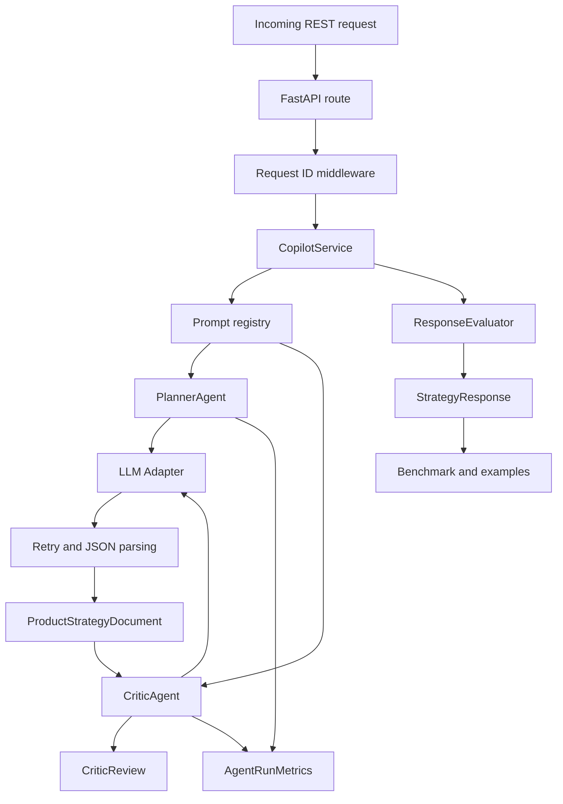

# Architecture

## Main components

- `api/`: HTTP boundary, request parsing, dependency injection
- `services/`: orchestration layer that coordinates planner, critic, and evaluation
- `agents/`: agent implementations with versioned prompts and typed outputs
- `core/`: config, prompt registry, model adapters, logging
- `evaluation/`: heuristic quality scoring, latency and cost rollups
- `tests/`: core logic and API behavior

## Zero-Cost Modes

- `mock`: deterministic offline baseline used by default for tests, regression checks, and benchmark reproducibility
- `local`: free OpenAI-compatible local model endpoint such as Ollama or LM Studio
- `openai`: optional hosted provider path kept behind environment configuration
